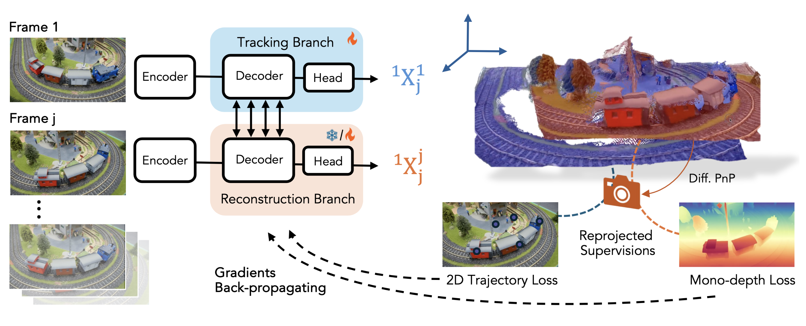

# St4RTrack: Simultaneous 4D Reconstruction and Tracking in the World (ICCV 2025)

<p align="center"> 
  
</p>


This is the official PyTorch implementation of **St4RTrack** (pronounced “Star Trek”). 

We propose a unified feed-forward framework that simultaneously reconstructs and tracks dynamic video content in a world coordinate frame from RGB inputs. Our method enables simultaneous 4D reconstruction and tracking by predicting two appropriately defined pointmaps for frame pairs, naturally combining 3D reconstruction with 3D tracking through video sequences.

**Key Features:**
- **Unified Representation**: Simultaneous 4D reconstruction and tracking in world coordinates
- **Feed-forward**: Efficient processing without post optimization
- **In-The-Wild Adaptation**: Test-time adaptation using reprojection loss on unlabeled data
- **Comprehensive Evaluation**: New WorldTrack benchmark for world coordinate tracking

Please refer to the [arXiv paper](https://arxiv.org/abs/2504.13152) for more technical details and [Project Page](https://st4rtrack.github.io/) for interactive video results.

## TODO
- [x] Clean code for dataset and loss computation
- [x] Add configurable track evaluation data root argument
- [x] Remove unused training arguments for cleaner codebase
- [x] Remove abs path in scripts
- [x] Release pre-trained model weights: [Hugging Face](https://huggingface.co/yupengchengg147/St4rTrack) and [Google Drive](https://drive.google.com/drive/folders/1uSfnZbzqa8pfIb6k383-BerLQ0m9-R1l?usp=sharing)
- [x] More unit tests  
- [x] Add dataset/benchmark download and preprocess instructions
- [x] Add pre-trained models download scripts  
- [x] Check requirements.txt

## Getting Started

### Installation

1. Clone St4RTrack with submodules:
```bash
git clone https://github.com/HavenFeng/St4RTrack.git
cd St4RTrack
```

2. Create the environment:
we use torch 2.5.1 with CUDA 12.1 for our implementation, you can set up the environment with 
```bash 
conda env create -f environment.yml
conda activate st4rtrack
```
optionally, you can also use
```bash
conda create -n st4rtrack python=3.12 cmake=3.14.0
conda activate st4rtrack
conda install pytorch torchvision pytorch-cuda=12.1 -c pytorch -c nvidia
pip install -r requirements.txt
# Optional dependencies for training and evaluation:
pip install -r requirements_optional.txt
```

3. Optional: Compile CUDA kernels for RoPE (faster runtime):
```bash
cd croco/models/curope/
python setup.py build_ext --inplace
cd ../../../
```

### Download Checkpoints

We currently provide fine-tuned model weights for St4RTrack, which can be downloaded locally via [Google Drive](https://drive.google.com/drive/folders/1uSfnZbzqa8pfIb6k383-BerLQ0m9-R1l?usp=sharing). We recommand `St4RTrack_Seqmode_reweightMax5.pth` by default.
Optionally, you can also load checkpoint via [Hugging Face](https://huggingface.co/yupengchengg147/St4rTrack)  by easily adding
```python
--hf_model "yupengchengg147/St4RTrack" \
--hf_variant seq \
--hf_force_download #optional
```
in training and inference command.

### Training

#### Preparing Data

Download the dataset for PointOdyssey and DynamicReplica:
```bash
bash data/download_po.sh
bash data/download_dynamic_replica.sh
```

For Kubric, please download and prepare the dataset based on the [official instructions](https://github.com/google-research/kubric).

#### Download Pre-Trained Models
```bash
mkdir -p checkpoints/
wget https://download.europe.naverlabs.com/ComputerVision/MASt3R/MASt3R_ViTLarge_BaseDecoder_512_catmlpdpt_metric.pth -P ./checkpoints/
```

#### Pair Mode Training
Train with pair-wise image reconstruction and dynamic pixel reweighting:
```bash
# Remember to replace the dataset path to your own path
# the script has been tested on a 4xA100(80G) machine
bash scripts_run/train_pair_reweight.sh
```

#### Sequence Mode Training
Train with sequence-based tracking:
```bash
# Remember to replace the dataset path to your own path
# the script has been tested on a 4xA100(80G) machine
bash scripts_run/train_seq_reweight.sh
```

#### Test-Time Adaptation
Fine-tune on specific sequences:
```bash
# Remember to replace the dataset path and checkpoint path to your own path
# the script has been tested on a 4xA100(80G) machine
bash scripts_run/train_tta.sh
```

<details>
<summary><strong>Training and Adaptation Improvements post Submission (Led by <a href="https://github.com/yupengchengg147">Pengcheng Yu</a>) </strong></summary>

After the initial submission, we identified and addressed training stability issues related to confidence estimation for dynamic pixels. Originally, the confidence-based loss function is:
```python
L = conf1 * l1 - alpha * log_conf1 + conf2 * l2 - alpha * log_conf2
```

We observed that the confidence-based loss formulation used in prior works (e.g., DUSt3R, MonSt3R, MASt3R) is suboptimal for St4RTrack, as it often leads the model to neglect pixels belonging to moving objects. Since DUSt3R-based models are mainly trained on static scenes, they tend to assign low confidence to dynamic or translucent pixels. As a result, during training, the model reduces `conf1` (confidence) rather than minimizing the actual error `l1`, which undermines learning on dynamic content. Additionally, simply removing the confidence term without introducing alternative constraints degrades performance, as previous approaches rely on confidence weighting for effective point-view regression.

**Our Quick Solution - Dynamic Pixel Reweighting for Head1:**
We reweight the confidence values of dynamic pixels in head1 by replacing them with scaled static pixel confidence:

```python
w = reweight_scale * conf1_static.max()  # or conf1_static.mean()
L = conf1_static*l1_static - alpha * log_conf1_static + w * l1_dynamic + conf2 * l2 - alpha * log_conf2
```

**Dynamic vs Static Pixel Classification:**
During training, pixels are classified based on ground-truth trajectory displacement:
- **Dynamic pixels**: Displacement > dataset-specific threshold
- **Static pixels**: Displacement ≤ threshold

**Threshold Selection Strategy:**
- **Pair mode training**:
  - *PointOdyssey* and *Dynamic Replica*: max(0.75 quantile displacement, mean displacement)
  - *Kubrick*: median displacement
- **Sequence mode training**: mean displacement across all datasets

This improvement significantly enhances training stability and final performance, especially for scenes with substantial dynamic content.

Here we show the quantitative comparision of tracking performance between model trained with and without Dynamic Pixel Reweighting for Head1. Please take Table 1 and Table 3 in the paper as reference.

### Table 1: APD (Average Percentage of points within Delta) ⬆️

| Method | All-points |  |  |  | Dynamic points |  |  |  |
|--------|------------|---|---|---|----------------|---|---|---|
|        | po | dr | adt | PStudio | po | dr | adt | PStudio |
| pair_mode with reweight | 67.29 | 71.28 | 68.97 | 67.59 | 69.76 | 74.65 | 76.22 | 67.59 |
| sequence with reweight | 67.34 | **74.34** | 73.03 | **70.67** | **72.04** | **76.82** | **78.01** | **70.67** |
| st4rtrack wo reweight | **67.95** | 73.74 | **76.00** | 69.67 | 68.71 | 68.13 | 75.34 | 69.67 |

### Table 3: EPE (End Point Error) ⬇️

| Method | All-points |  |  |  | Dynamic points |  |  |  |
|--------|------------|---|---|---|----------------|---|---|---|
|        | po | dr | adt | PStudio | po | dr | adt | PStudio |
| pair_mode with reweight | 0.3163 | 0.3016 | 0.3324 | 0.2850 | 0.2612 | 0.2180 | 0.1158 | 0.2850 |
| sequence with reweight | 0.3169 | **0.2605** | 0.2946 | **0.2489** | **0.2367** | **0.1978** | **0.1087** | **0.2489** |
| st4rtrack wo reweight | **0.3140** | 0.2682 | **0.2680** | 0.2637 | 0.2970 | 0.2961 | 0.1212 | 0.2637 |

### Visual Comparison


</details>

### Inference

Run inference on your data:
```bash
python infer.py \
    --batch_size 128 \
    --input_dir /path/to/your/data \
    --weights checkpoints/your_model.pth \
    --output_dir results/your_path
```

Visualize the results:
```bash
python visualizer_st4rtrack.py --traj_path results/your_path
```

### Evaluation

Evaluate on standard benchmarks:
```bash
bash scripts_run/eval.sh
```

## Evaluation Benchmarks

Download the WorldTrack dataset from [Google Drive](https://drive.google.com/drive/folders/1-JW88ru30irMYyFab_4YBQbGbd9tKpXV?usp=sharing) and place it in `./data/worldtrack_release`, the structure should be like this:
```
./data/worldtrack_release/
└───adt_mini/
└───pstudio_mini/
└───po_mini/
└───ds_mini/
└───tum/
```

We provide the following evaluation datasets:
- **Trajectory evaluation datasets**: adt_mini, pstudio_mini, po_mini, ds_mini
- **Reconstruction evaluation datasets**: po_mini, tum

## Citation

If you find our work useful, please cite:

```bibtex
@inproceedings{st4rtrack2025,
  title={St4RTrack: Simultaneous 4D Reconstruction and Tracking in the World},
  author={Feng*, Haiwen and Zhang*, Junyi and Wang, Qianqian and Ye, Yufei and Yu, Pengcheng and Black, Michael J. and Darrell, Trevor and Kanazawa, Angjoo},
  booktitle={Proceedings of the IEEE/CVF International Conference on Computer Vision},
  year={2025}
}
```

## License

This code and model are available for non-commercial scientific research purposes.

## Concurrent Efforts

Shout-out to other concurrent efforts on pointmap-based dense 3D tracking:

ZeroMSF - https://research.nvidia.com/labs/lpr/zero_msf/  
DynaDUSt3R - https://stereo4d.github.io/  
Dynamic Point Maps - https://www.robots.ox.ac.uk/~vgg/research/dynamic-point-maps/

## Acknowledgements

We would like to thank the authors of DUSt3R and MonST3R for their foundational work in stereo matching and 3D reconstruction. We also thank the contributors of PointOdyssey, TUM-Dynamics, Dynamic Replica, TAPVid-3D and DAVIS datasets for enabling comprehensive evaluation.

This work was supported by UC Berkeley and the Max Planck Institute for Intelligent Systems.
